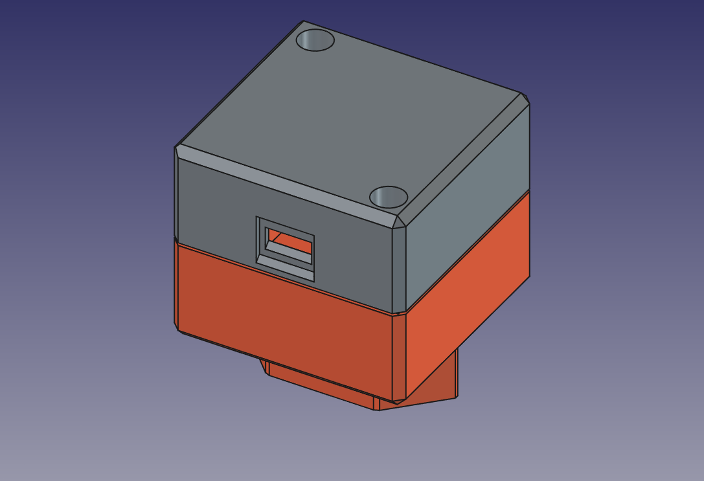
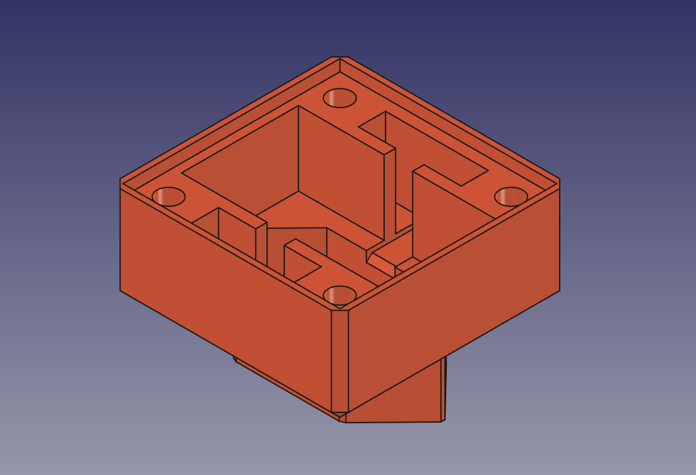
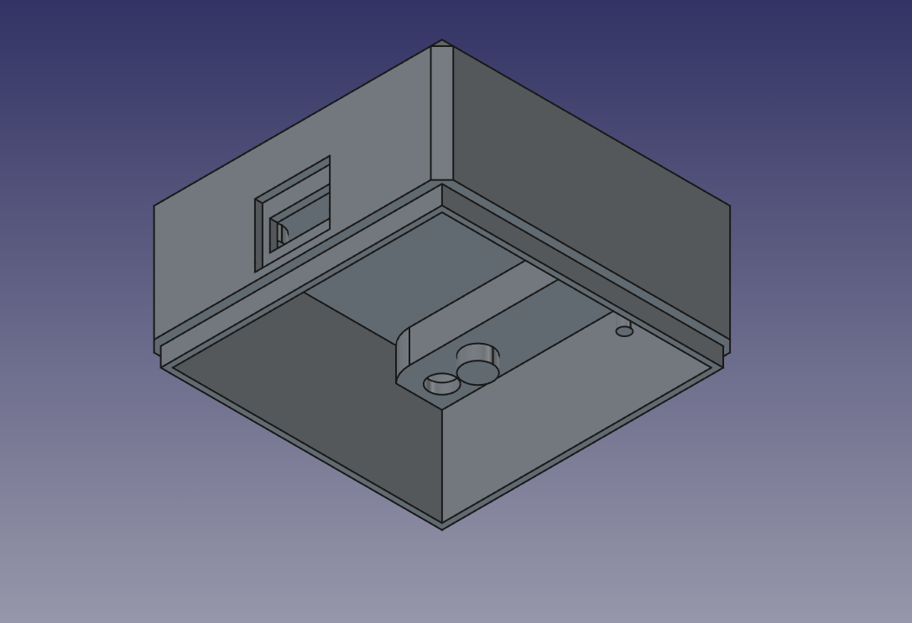

# MQTT Pocket Gateway

Firmware for an ESP8266-based bridge that connects ESP-NOW devices to MQTT and provides a lightweight local MQTT broker, avoiding the need for a full external broker installation in simple deployments.

## Overview

This project turns a D1 Mini (ESP8266) into a compact network gateway that can:

- receive ESPNOW packets from nearby ESP devices
- bridge ESPNOW payloads into a local MQTT broker
- host a local web UI for configuration and firmware updates
- optionally forward local MQTT traffic to a remote broker
- optionally subscribe to remote MQTT and relay messages locally

The firmware is designed for reliability on constrained hardware and uses asynchronous networking libraries for responsive HTTP and MQTT operation.

## Key Features

- Built-in lightweight local MQTT broker using `PicoMQTT`, ideal when a full broker like Mosquitto is overkill
- Remote MQTT client support with optional publish / subscribe bridging
- ESPNOW message receiver and packet routing
- EEPROM-backed configurable settings with CRC32 validation
- Wi-Fi configuration and captive portal via `ESPAsyncWiFiManager`
- OTA firmware updates through browser upload
- MDNS service advertising for easier discovery
- NTP boot timestamp logging and runtime heap monitoring

## Hardware Target

- `D1 Mini` or other ESP8266-based board
- PlatformIO environment configured for `espressif8266`

## Enclosure and Build Model

- `model/` contains a professional-looking 3D printed enclosure optimized for this gateway
- The case is designed to fit a Wemos D1 board, a tiny HLK-PM05 AC/DC module, and four heat-set inserts
- Includes CAD sources: `mqtt_wemos.FCStd` and STEP exports for mechanical review and fabrication

### Enclosure Preview







This makes the project ready for a polished hardware deployment without additional mechanical design work.

## Software Components

- `src/main.cpp` — program entrypoint, setup, loop, web handlers, MQTT and ESPNOW logic
- `include/main.h` — common includes and debug utilities
- `include/eeprom.h` — persistent configuration storage, CRC validation, default values
- `include/esp2mqtt.h` — ESPNOW packet structure and protocol constants
- `include/html.h` — minimal web interface generation helpers
- `include/version.h` — build/version metadata

## Build Instructions

1. Install PlatformIO in Visual Studio Code or use the PlatformIO CLI.
2. Open the project folder.
3. Build with the `d1` environment:

```bash
platformio run -e d1
```

4. Upload to the board:

```bash
platformio run -e d1 -t upload
```

5. Monitor serial output:

```bash
platformio device monitor -e d1
```

## Configuration

The firmware stores settings in EEPROM, including:

- device name
- fixed local MQTT broker IP and port
- ESPNOW-to-MQTT bridge enable flag
- remote MQTT broker connection details
- remote topic prefix add/remove rules
- remote send/receive toggles

A built-in web interface serves:

- `/` — status page with heap, IP, boot time, and controls
- `/config` — configuration form and OTA update upload
- `/reboot` — reboot the device
- `/reset` — reset EEPROM and Wi-Fi settings

## Networking Behavior

- Local MQTT broker listens on the configured port
- All local MQTT traffic is subscribed to and can be forwarded to the remote broker when enabled
- Remote MQTT traffic can be subscribed to and republished into the local broker
- ESPNOW packets are filtered by a shared signature and device name
- ESPNOW PING messages receive an automatic PONG reply

## Notes

- The firmware is optimized for low-resource embedded operation and avoids blocking network calls in the main loop.
- HTML configuration pages are generated dynamically using simple macros and raw string assembly.
- Sensitive values are stored in EEPROM but displayed in the local web UI, so use in trusted network environments.

## Dependencies

The project uses the following PlatformIO libraries:

- `ESPAsyncWebServer`
- `ESPAsyncWiFiManager`
- `ESPAsyncHTTPUpdateServer`
- `PicoMQTT`
- `ESP_EEPROM`
- `CRC32`

See `platformio.ini` for exact dependency and environment configuration.

## License

This project is licensed under the GNU General Public License version 3 (GPLv3).
See the `LICENSE` file for full terms and conditions.
